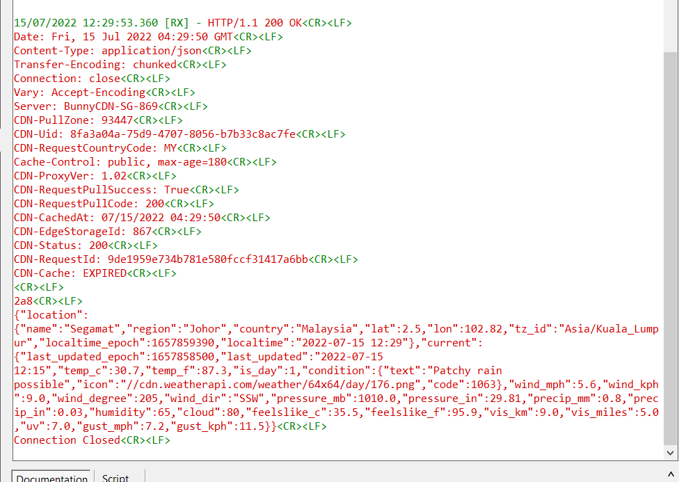
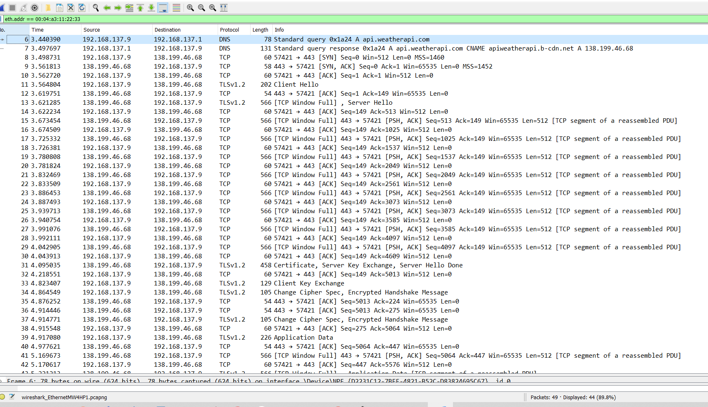
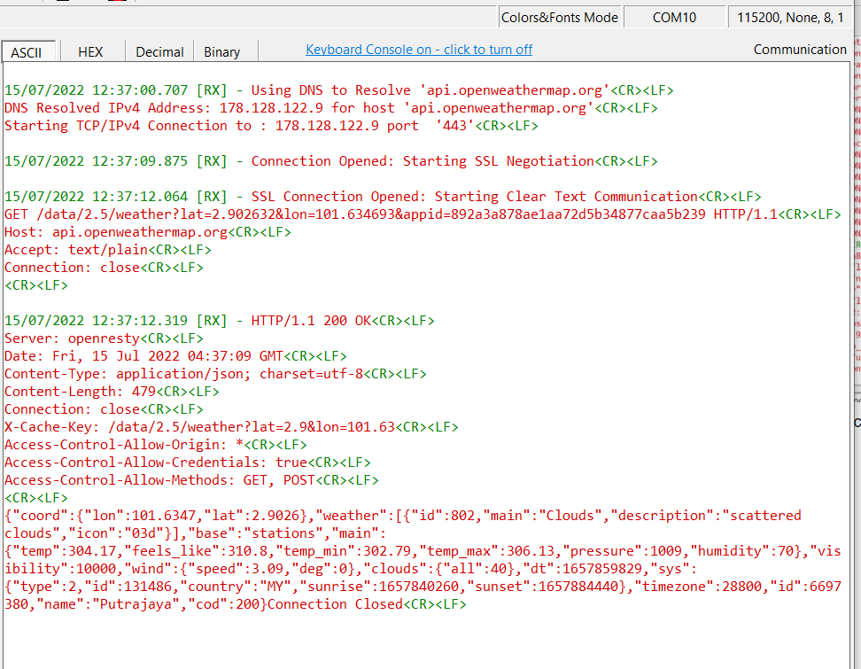
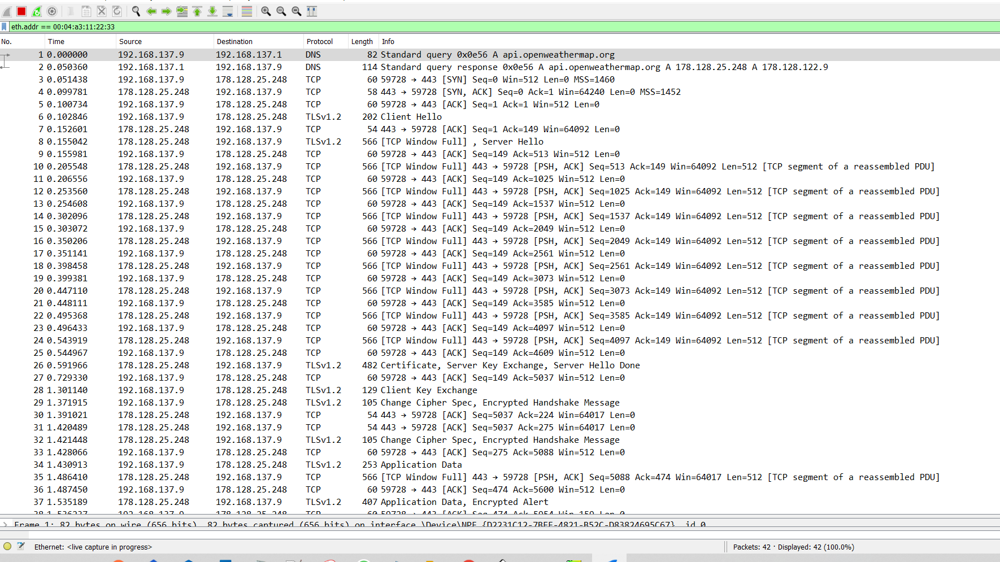
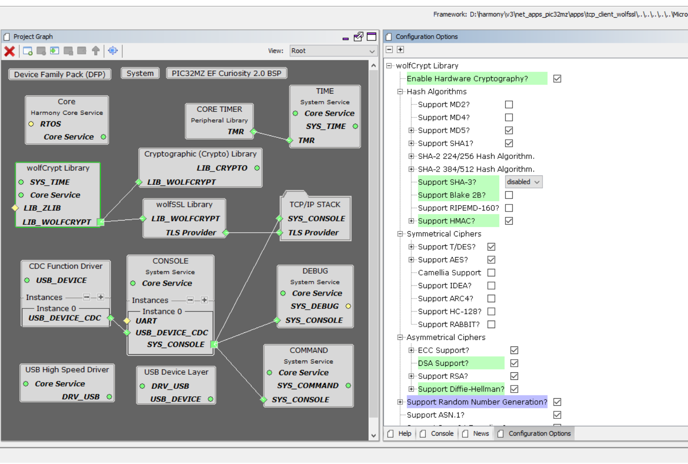

# TCP Client WolfSSL
Environment:
1. Board: PIC32MZ Curiosity V2
2. XC32 v2.5
3. Harmony v3

Decription

Simple code to demo how TLS v1.2 can be used to pull environmental weather datas from popular APIs like Weather API and OpenWeatherMap API over secured connection.
This demo featuring 
1. USB CDC
2. TCPIP I/F with 100Mbps MIIM PHY
3. System TIMER Services
4. Cryptography TLSv1.2.

Instruction:

1. Press SW1 to retrieve datas from api https://api.weatherapi.com
   1. Open Terminal USB at your COM port at data rate 115200.\
    Outcome:
      1. 
      2. Packets
         1. 
2. Press SW2 to get data from api https://api.openweathermap.org
   1. Outcome:
      1. 
      2. Packets:
         1. 
3. MHC v3:
   1. 
